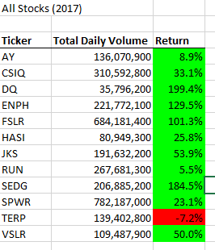
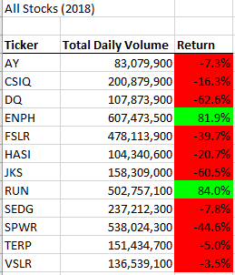
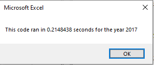
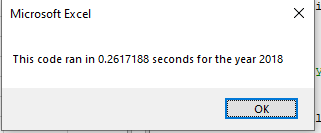

# Stock-Analysis
## Overview
The purpose of this analysis was to measure the performance of a set of stocks for our friend Steve. He is looking to get some information to provide to his parents concerning the returns or losses in the stock market. We were able to write a VBA script that reads the stock information and stores each piece in its proper place. Our main concerns were the daily trading volume, and the return or loss over the entire year. For this prokect we were using data from 2017 and 2018. To make things simple for Steve, and to enable us to use our code in different situations, we set up a message box that asks the user to input the year they are looking for. 
## Results
As shown from the pictures below, 2017 was a far more profitable year for the stock market. Ten of the twelve stocks we tracked returned positive results in 2017, as opposed to two of twelve in 2018. this highlights the volatiliy of the stock-marktet, and how a stock can have high returns one year and then low or no returns the next year. One conclusion we can draw from this, is that our data is limited and should not be used to make any decisions. We only look at two years, which is not a long enough time period to establish a trend or to provide an accurate window into the long term success of particular stocks. Our code was succesful and ran quickly, as displayed by the images below. 

 
 
 

## Refactor Summary
  1. Refactoring code can help understand exactly what your code is doing, how it does it, and where there might be room for improvement. That being said, if you are not focused you can make slight changes that affect how your code runs, potentially creating errors where there were none before. You can also use refactoring to alter code so that it can be used across mutlple purposes, instead of the one you initially intended. That also can create issues, however, as the refactored code might not serve its original purpose as well as it once did.
  2. For our analysis, the refactored code helped greatly. The introduction of the tickersIndex variable, in particular, enabled our code to be much more intuitive. While our orininal code was only able to be used for the specific stocks Steve asked for, our refactored code allowed us to utilize the entire stock market. This kind of repurposing is an example of what was referenced above; the code was made for a very narrow purpose but was braodened and made more effective by refactoring. We did not run into any major issues in our refactoring, as the code was already very similiar to the refactored goal. 
  
